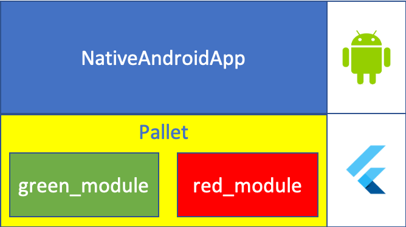

# How to add Flutter modules into an existing Native Android app

---

## Plugin vs Module

| Plugin | Module |
|---|---|
| Maing native funtionality available to Flutter | Integrating Flutter with an existing native application |

---

### Step 1. Android native app

```kotlin
class MainActivity : AppCompatActivity() {

    override fun onCreate(savedInstanceState: Bundle?) {
        super.onCreate(savedInstanceState)
        setContentView(R.layout.activity_main)
    }

    fun onClickGreen(view: View) {
        // TODO call flutter screen
    }
}
```

---

### Step 2. Create a Flutter module

```dart
void main() => runApp(GreenModule());

class GreenModule extends StatelessWidget {
  @override
  Widget build(BuildContext context) {
    return MaterialApp(
      home: Scaffold(
        backgroundColor: Colors.green,
        body: Center(
          child: Text("Flutter Green Screen",
            style: TextStyle(color: Colors.white)),
        ),
      ));
  }
}
```

---

### Step 3. Import a Flutter module

```kotlin
class MainActivity : AppCompatActivity() {

    override fun onCreate(savedInstanceState: Bundle?) {
        super.onCreate(savedInstanceState)
        setContentView(R.layout.activity_main)
    }

    fun onClickGreen(view: View) {
        startActivity(
            FlutterActivity.createDefaultIntent(this)
        )
    }
}
```

---


---

### Step 4. Increase speed

pre-warm `FlutterEngine` and caching

```kotlin
class NativeApplication: Application() {

    override fun onCreate() {
        super.onCreate()

        val flutterEngine = FlutterEngine(this)

        flutterEngine.dartExecutor.executeDartEntrypoint(
            DartExecutor.DartEntrypoint.createDefault()
        )

        FlutterEngineCache.getInstance()
            .put("green", flutterEngine)
    }
}
```

---

```kotlin
class MainActivity : AppCompatActivity() {

    override fun onCreate(savedInstanceState: Bundle?) {
        super.onCreate(savedInstanceState)
        setContentView(R.layout.activity_main)
    }

    fun onClickGreen(view: View) {
        startActivity(
            FlutterActivity
                .withCachedEngine("green")
                .build(this)
        )
    }
}
```

---

### Step 5. Add another Flutter module


---


---



---

```yaml
#pubspec.yaml
dependencies:
  greenmodule:
    path: ../green_module
  redmodule:
    path: ../red_module
```

```dart
void main() => runApp(Pallet(route: window.defaultRouteName));

class Pallet extends StatelessWidget {
  final String route;
  Pallet({this.route});

  @override
  Widget build(BuildContext context) {
    switch(route) {
      case "green": return GreenModule();
      case "red": return RedModule();
      default: return GreenModule();
    }
  }
}
```

---

NativeApp

Check module name

```groovy
// settings.gradle
rootProject.name='NativeApp'
include ':app'
setBinding(new Binding([gradle: this]))
evaluate(new File(
  settingsDir,
  '../pallet/.android/include_flutter.groovy'
))

include ':pallet'
project(':pallet').projectDir = new File('../pallet')
```

---

NativeApplication.onCreate()

```kotlin
val greenEngine = FlutterEngine(this)
greenEngine.navigationChannel.setInitialRoute("green")
greenEngine.dartExecutor.executeDartEntrypoint(
    DartExecutor.DartEntrypoint.createDefault()
)
FlutterEngineCache.getInstance().put("green", greenEngine)

val redEngine = FlutterEngine(this)
redEngine.navigationChannel.setInitialRoute("red")
redEngine.dartExecutor.executeDartEntrypoint(
    DartExecutor.DartEntrypoint.createDefault()
)
FlutterEngineCache.getInstance().put("red", redEngine)
```

---

```kotlin
class MainActivity : AppCompatActivity() {

    fun onClickGreen(view: View) {
        startActivity(
            FlutterActivity
                .withCachedEngine("green").build(this))
    }

    fun onClickRed(view: View) {
        startActivity(
            FlutterActivity
                .withCachedEngine("red").build(this))
    }
}
```

---

## Uncovered contents

* Add a Flutter Fragment
* Adding to an iOS app
* How to pass arguments
  - How to use MethodChannel

---

## Links

https://flutter.dev/docs/development/add-to-app

https://github.com/flutter/flutter/issues/39707#issuecomment-569120877

Sample project: https://github.com/KennyYi/flutter_module_sample
